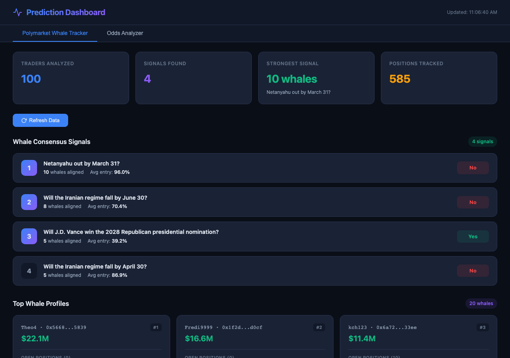

# Prediction Dashboard

A real-time analytics tool that tracks the top 100 most profitable Polymarket traders, identifies consensus signals from whale activity, and compares sports betting odds across major bookmakers.

Built with zero dependencies — vanilla HTML, CSS, and JavaScript with a lightweight Node.js proxy server.



## Features

### Polymarket Whale Tracker

- **Leaderboard Scraping** — Pulls the top 100 all-time most profitable traders from Polymarket's Data API
- **Parallel Position Fetching** — Retrieves open positions for each trader in batches of 10 to stay within rate limits
- **Signal Engine** — Detects markets where 5+ top traders hold the same position, ranked by consensus strength
- **Noise Filtering** — Only surfaces positions above $500 to focus on high-conviction bets
- **Live Metrics** — Dashboard cards showing traders analyzed, signals found, strongest signal, and total positions tracked

### Odds Analyzer

- **Multi-Sport Support** — NBA, NFL, MLB, and NHL odds from The Odds API
- **Bookmaker Comparison** — Side-by-side odds from every available US bookmaker
- **Value Detection** — Best available line highlighted per team
- **Implied Probability** — Calculated and displayed for every line
- **Persistent API Key** — Stored in localStorage, enter it once

## Quick Start

```bash
git clone https://github.com/judebornstein/prediction-dashboard.git
cd prediction-dashboard
./start.sh
```

This starts the Node.js server on `http://localhost:3000` and opens the dashboard in your browser.

**Requirements:** Node.js (no npm install needed)

### Odds Analyzer Setup

The Odds Analyzer tab requires a free API key from [The Odds API](https://the-odds-api.com/). Enter it in the input field — it's saved to localStorage automatically.

## Architecture

```
prediction-dashboard/
├── index.html      # Single-file frontend (HTML + CSS + JS)
├── server.js       # Node.js proxy server (static files + API proxying)
├── start.sh        # One-command launcher
└── README.md
```

**Why a proxy server?** Browser CORS policies block direct API calls to Polymarket and The Odds API from a local file. The Node.js server proxies these requests server-side:

| Frontend Route | Proxied To |
|---|---|
| `/api/polymarket-data/*` | `data-api.polymarket.com/*` |
| `/api/odds/*` | `api.the-odds-api.com/v4/*` |

## Tech Stack

- **Frontend:** Vanilla HTML, CSS, JavaScript — no frameworks, no build step
- **Backend:** Node.js `http` + `https` modules — no dependencies
- **APIs:** [Polymarket Data API](https://docs.polymarket.com), [The Odds API](https://the-odds-api.com/)
- **Design:** Dark theme, responsive layout, modern card-based UI

## License

MIT
